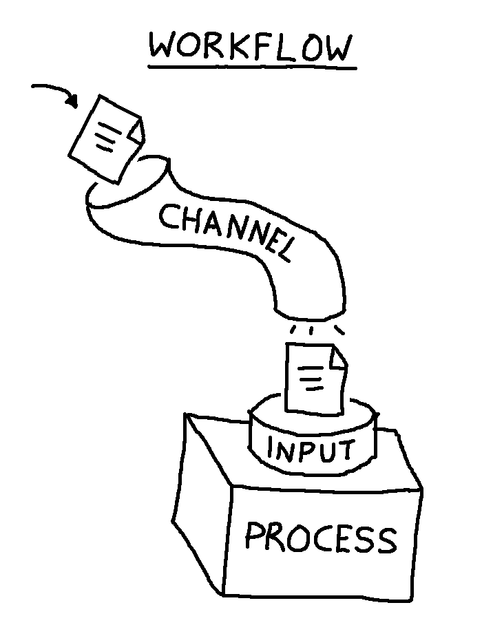

% Nextflow Introduction
% John Salamon
% Aug 28, 2024


# A brief history of Nextflow

::: incremental
- 2013: Nextflow, created by Paolo Di Tommaso, is publicly released [(article on history)][0]
- 2017: Article published in Nature Biotechnology [(Di Tommaso *et al* 2017)][1]
- 2018: The [nf-core community project][2] led by Phil Ewels is started
- 2018: Seqera Labs is launched, which Ziad can tell you more about later
- 2020: Nextflow DSL2 is released, a major revamp of the language
- 2024: As of today, the latest stable release of Nextflow is [24.04][3]
:::

[0]: https://elifesciences.org/labs/d193babe/the-story-of-nextflow-building-a-modern-pipeline-orchestrator
[1]: https://www.nature.com/articles/nbt.3820
[2]: https://nf-co.re/about#history-of-nf-core
[3]: https://www.nextflow.io/blog/2024/nextflow-2404-highlights.html


# Problems Nextflow aims to solve

<ul class="incremental">
- Complicated workflows are hard to maintain and share
    - How do you reproduce the setup of all the different software your workflow requires?
    - If you want to run your workflow on a different environment, how do you do that?
</ul>
<ul class="incremental">
- If your workflow crashes, it can be hard to recover
    - How can you have confidence that the workflow has completed correctly?
    - If you need to change something in your workflow, how do you know what needs to be rerun?
</ul>
<ul class="incremental">
- It's difficult to monitor execution and resource utilisation
    - How do you track the progress of your workflow?
    - How do you know if you've allocated excessive computational resources?
</ul>

# How Nextflow aims to solve these problems

<ul class="incremental">
- **Reproducibility and portability**
    - Nextflow is built with containers and version control in mind
    - Docker, Singularity, podman, even just a conda env - managing your environment setup is a single line
    - Configuration of HPC schedulers, cloud credentials, etc is independent of your workflow, Nextflow manages this all for you
</ul>
<ul class="incremental">
- **Familiar tools**
    - You can use all of them same bioinformatics command line tools you are familiar with
    - You can write scripts in any language you like, Nextflow just orchestrates the execution
</ul>
<ul class="incremental">
- **Dataflow programming paradigm**
    - Each task (a process in Nextflow lingo) is totally independent, and has specific inputs and outputs
    - A workflow describes which tasks data must flow through as a graph (specifically a DAG) of connected tasks
    - In Nextflow the connections between these tasks are called channels
</ul>

# Core concepts (Workflow, Channel, Process)

::: row
::: column

- A Nextflow [**workflow**](https://www.nextflow.io/docs/latest/workflow.html) explicitly describes how 
  [**processes**](https://www.nextflow.io/docs/latest/process.html) (tasks) are connected
    - Every process is a self-contained black box
    - A process can run as soon as all of its inputs are valid
    - Processes always run in *parallel*
- Processes are connected by [**channels**](https://www.nextflow.io/docs/latest/channel.html)
    - Every input and output of a process is a channel
    - Usually channels contain files

:::
::: column



:::
:::


# Core concepts (Operators)

- Within workflows, [**operators**](https://www.nextflow.io/docs/latest/operator.html) can manipulate channels
    - e.g., [*collect*](https://www.nextflow.io/docs/latest/operator.html#collect) each item into a list
- The *pipe* (`|`) is a special operator, and it works just like a pipe in bash
    - You can pipe from any process/operator with one output channel to any process/operator with one input channel

```
# Piping
A | B | C

# Versus, more procedural style (same outcome)
ch_out = A()
ch_out_2 = B(ch_out)
C(ch_out_2)
```

# Implementation details

- Nextflow is a DSL, implemented in the Groovy programming language.
- Nextflow inherits nearly all of its syntax directly from Groovy, so knowing it is helpful
  - Groovy is more or less a superset of Java, so knowing Java also doesn't hurt
- On a surface level Nextflow code looks similar to Python. Here are a few quick tips:

```
// Use two forward slashes for single line comments
// Assign variables like this:
x = 2

// define Lists
myList = [1,2,3]
// and Maps
myMap = ["key": "value"]

// access object methods and attributes with a dot
myList.size() // returns 3

// parentheses can be omitted for single parameter functions 
// e.g., the following two lines are equivalent:
println("hello world")
println "hello world"

```

- Read more: 
  [Groovy basics](https://www.nextflow.io/docs/latest/script.html#groovy-basics),
  [Nextflow docs overview](https://www.nextflow.io/docs/latest/overview.html)


# High level comparison with Snakemake

|                  | Nextflow        | Snakemake     |
|------------------|-----------------|---------------|
| Language extends | Groovy          | Python        |
| DAG is defined   | Explicitly      | Implicitly    |
| Root of graph is | Inputs          | Outputs       |
| History          | More commercial | More academic |

# Paradigms

Snakemake - makefile style (start by naming outputs)
 - define multiple rules
 - naming a target then generates your DAG by combining rules
 - your workflow structure is *implicit*

Nextflow - dataflow programming (start by naming inputs)
 - define multiple processes
 - join them together in a workflow, *explicity*
 - You just provide inputs and everything runs

# nf-core

- 100+ pipelines, and 1000+ modules, are publicly available via [nf-core](https://nf-co.re/)
- Large community, comes with its own specific tooling and templates, as well as configuration profiles for many institutions and platforms


# In the next section...

Let's write a workflow!

